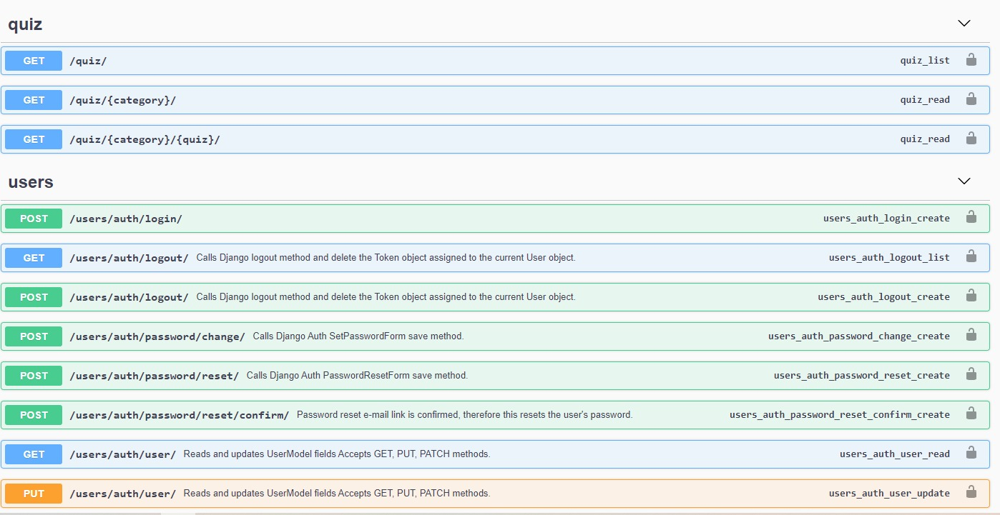

# Quiz-App-Django-API


<h1 align="center">Django Quiz App</h1>

<div align="center">
  <h3>
    <a href="https://qqizz-app.herokuapp.com/">
      Project
    </a>
 
  </h3>
</div>

<!-- TABLE OF CONTENTS -->

## Table of Contents

- [Overview](#overview)
- [Built With](#built-with)
- [Features](#features)
- [How to use](#how-to-use)
- [Acknowledgements](#acknowledgements)
- [Contact](#contact)

<!-- OVERVIEW -->

## Overview



### Built With

<!-- This section should list any major frameworks that you built your project using. Here are a few examples.-->

- Django

## How To Use


```bash
# Clone this repository
$ git clone https://github.com/aemingenc/Django-Quiz-App

# Install dependencies
    $ python -m venv env
    > env/Scripts/activate (for win OS)
    $ source env/bin/activate (for macOs/linux OS)
    $ pip install -r requirements.txt

# Run the app
$ python manage.py runserver
```

## Acknowledgements

- Information for your projects

## Contact

- Email (aemingenc@gmail.com)
- GitHub (https://github.com/aemingenc)

- Linkedin (https://www.linkedin.com/in/abdullah-emin-gen%C3%A7-887312216/)
